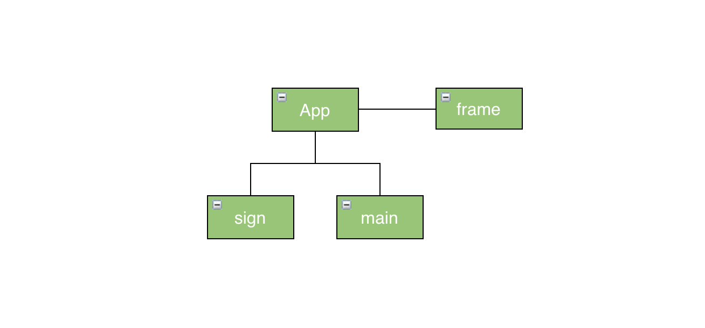
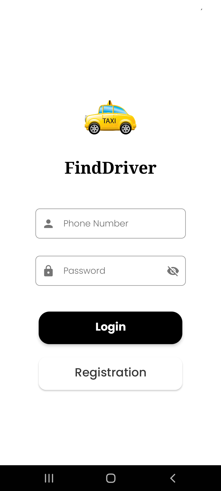
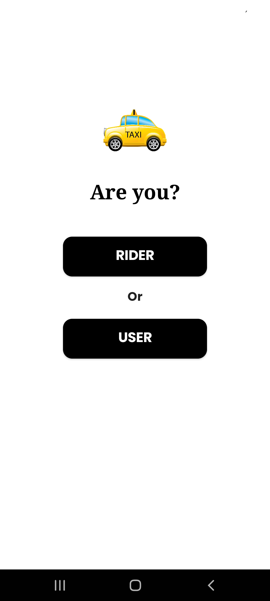

# Welcome to BikeaGB

It's an app built using the MVVM, Repository pattern and Clean Architecture with JetPack Compose for UI Presentation,that show user registration.

 

## Index

- [Key Features](#key-features)
- [Architecture](#architecture)
- [ScreenShots](#screenShots)
- [Libraries](#libraries)
- [Future Enhancements](#future-enhancements)

 

## Key Features
1. **Separation of Concerns:** The app is built using Uncle Bob's clean architecture (see architecture below)
2. **Reusable feature modules:** Modern feature module design pattern is used so that in future the same module is used other apps also.
3. **Scalable navigation architecture:** Feature modules are independent of app-level implementation detail. Navigation architecture can be changed at anhy time without effecting the features

 

## Architecture
The app is built with scalability in mind. to maintain the separation of concerns, [Clean Architecture](https://blog.cleancoder.com/uncle-bob/2012/08/13/the-clean-architecture.html) by Robert C. Martin, is used. The diagram below shows how the clean architecture is mapped to this android application.

### Flow of control:
The design pattern for this app is a Unidirectional data flow (UDF) where state flows down and events flow up. Flow of control is one directional only. Any inner layer doesn't know about any layer outside of it. If an inner layer needs to communicate to an outer layer, it is done via Dependency Inversion.
To maintain this separation over the course of time, separate android/kotlin modules can be used for each layer for bigger features.  

## Modules
The app has mainly following modules

### core 
- **Domain** - module provides a bridge between data layer and UI layer.Domain layer is Platform independent. It gets the data from remote or local datasource to UI layer.
- **Network** - module is responsible for getting data from remote datasource and provide it to Domain layer. 
### framework
It will contain the general methods and classes that will need in all our feature modules and app module like theming,components,utility functions.

### Feature Modules
- **Sign** - contains the login and registration of rider and user.
Feature modules are unaware of each other. Hence, they can be used independently in any app

### Navigation 

The feature modules are unaware of the app-level navigation. App controls the navigation between each module. Currently, it uses Jetpack Navigation. But this can be changed at any time without affecting any feature module.

 

This is implemented as per [Google's recommendation](https://developer.android.com/guide/navigation/navigation-multi-module) for multi-module navigation. This allows us to have an independent navigation architecture in each feature module.

 

[//]: # (## Testing Strategy)

[//]: # ()
[//]: # (There are examples of 2 types of testing strategies in this project:)

[//]: # ()
[//]: # (**1. Class level unit testing**)

[//]: # (`RoomRepositoryImplTest` tests the class `RoomRepositoryImpl` using the conventional unit testing methodology commonly practised in the Android world. The unit under test here is the class and its methods. The API of the unit is the `RoomRepository` interface.)

[//]: # ()
[//]: # (**2. Module level unit testing**)

[//]: # (`RoomListViewModelTest` tests the class `RoomListViewModel` using the unit testing methodology as practised in TDD. The unit under test here is the room-list module &#40;non-UI part&#41;. The API of the unit is the `RoomListViewModel` class.)

[//]: # ()
[//]: # (This practice is not common in the Android community but it is very beneficial because it helps test the functionality of your modules, without testing the implementation details. Kent Beck, the creator of TDD and Uncle Bob, the co-founder of Agile Manifesto have some great articles on this topic.)

[//]: # ()
[//]: # (### Testing Libraries:)

[//]: # (- **JUnit4** - Unit testing framework)

[//]: # (- **Mockk** - Creating test doubles)

[//]: # (- **Google Truth** - For fluent, readable assertions)

[//]: # (- **Turbine** - For easier testing of Kotlin flows.)

[//]: # ()
[//]: # ( )

## Screenshots

  
 

 

